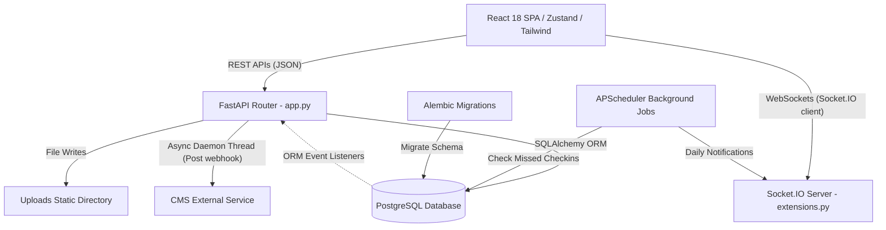

# PeopleHub: System Architecture & Integration

## 1. High-Level Component Architecture
PeopleHub implements a classic decoupled Single Page Application (SPA) and REST API architecture, enriched with WebSockets for real-time channels:



---

## 2. Component Breakdown

### Frontend: React Single Page Application (SPA)
- **Role:** Presents the user interfaces, coordinates routing, handles UI-side validations, and connects to WebSockets.
- **State Management:** **Zustand** stores handle token states, user profile snapshots, and message rooms client-side.
- **Service Layer:** Axios wrapper handles API calls, automatic JWT inclusion in authorization headers, and error handling.

### Backend: FastAPI & Socket.IO Web Server
- **REST Engine:** FastAPI maps routes (`routes/*.py`) into modular routers, validates requests via Pydantic model equivalents or raw parameters, and interacts with PostgreSQL.
- **WebSocket Engine (`extensions.py`):** Integrates python-socketio to expose event handlers. Implements `SocketIOCompat` to map sid contexts using Python `contextvars` for thread-safe session tracking.
- **Static Assets:** Serves binary files (e.g. dynamic profiles, documents, payslip downloads) stored in the `uploads/` root folder.

### Database: PostgreSQL Relational Database
- **Storage:** Persists all relational entities (Users, Employees, Attendance, Leaves, Appraisals, etc.).
- **Object Relational Mapper (ORM):** SQLAlchemy handles database querying, session lifecycle controls (scoped session per API request), and relationship loaders.

---

## 3. Real-Time WebSocket Communication Flow
WebSocket connections are established on client startup (`socket.ts` connecting to `/socket.io`).
- **Authentication & Room Placement:** On connecting, clients emit a `"join"` event containing their `employee_id`. The server maps them to their private room (named by their ID) and a role-based room (`managers` or `employees`) using database verification.
- **Private Messaging:**
  ```mermaid
  sequenceDiagram
      participant Alice as Employee Alice
      participant PH as PeopleHub Socket.IO
      participant DB as PostgreSQL
      participant Bob as Employee Bob
      
      Alice->>PH: Emit "send_message" (sender_id, receiver_id, text)
      PH->>DB: Save Message to Communication table (status committed)
      PH->>Bob: Emit "receive_message" (to Bob's Room)
      PH->>Alice: Emit "message_sent" (confirming status)
  ```
- **Broadcasting Announcements:** Admins emit `"send_announcement"`. The backend persists it in `Communication` table (type: `announcement`) and broadcasts it to target rooms (`employees`, `managers`, or broad broadcast).

---

## 4. CMS Webhook Synchronization Flow
PeopleHub utilizes database hooks (SQLAlchemy `after_insert`, `after_update`, and `after_delete` events) to sync credentials, roles, and teams to an external CMS backend:

1. **Trigger:** An Admin creates or modifies a User, Team, or Role model in PeopleHub.
2. **Hook Execution:** SQLAlchemy event listeners (`models/user.py`) trap the event.
3. **Serialization:** Target records are serialized into payload JSON dictionaries.
4. **Asynchronous Handover:** The payload is passed to `send_sync_event` (`utils/sync_client.py`).
5. **Worker Thread Execution:**
   - A daemon thread is spawned (`threading.Thread`).
   - Standard library `urllib.request` sends a POST request to `CMS_SYNC_URL`.
   - The request contains header `X-Sync-Secret` (verifying request legitimacy).
   - Timeout is set to `2 seconds` to prevent thread hangs.
   - Failures (network drops) trigger silent logging warnings rather than database rollback, ensuring high reliability.

---

## 5. Background Schedulers
The system runs `APScheduler.schedulers.background.BackgroundScheduler` inside `app.py`:
- **Job 1: Missed Check-in Monitor:** Runs **every 1 minute** (`check_missed_checkins`). Inspects check-in metrics to detect gaps and flag anomalies.
- **Job 2: Daily Notifications Generator:** Runs **daily at midnight** (`cron` trigger at `00:00`). Runs batch logic to initialize date variables, process leaves, reset daily logs, and generate dashboard cards.
