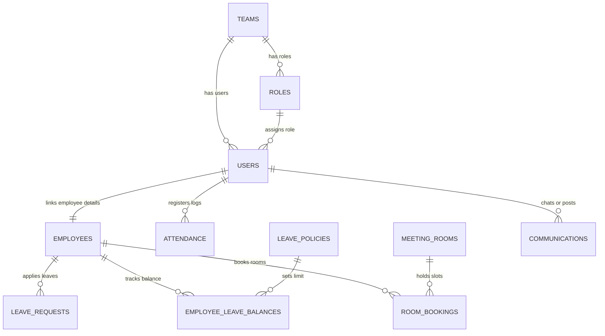

# PeopleHub: Database Design & Data Dictionary

## 1. Entity-Relationship (ER) Schema Layout
The database schema stores all records in PostgreSQL. Relationships are maintained via strict foreign key constraints:



---

## 2. Core Tables Data Dictionary

### Table: `users`
Represents client accounts credential registries.
- `id` (SERIAL, PK): Unique identification.
- `full_name` (VARCHAR(200), NOT NULL): User's legal name.
- `email` (VARCHAR(300), UNIQUE, NOT NULL): Personal contact email.
- `company_email` (VARCHAR(300), UNIQUE, NOT NULL): Official workspace email (used for login identification).
- `password_hash` (VARCHAR(500), NOT NULL): Cryptographic hash of the credential password.
- `role_id` (INTEGER, FK -> `roles.id`, NOT NULL): Assigned RBAC role.
- `team_id` (INTEGER, FK -> `teams.id`, NULLABLE): Assigned division team.
- `access_level` (VARCHAR(50)): Default is `"standard"`; options include `"manager"`, `"admin"`.
- `status` (VARCHAR(20)): Default is `"active"`.
- `is_active` (BOOLEAN): Defaults to `true`.
- `seen_announcement_ids` (JSON): Array tracking seen broadcast IDs.

### Table: `employees`
Contains profile onboarding details, banking, qualifications, binary credentials, and payroll details.
- `id` (SERIAL, PK): Internal surrogate identification.
- `user_id` (INTEGER, FK -> `users.id`): Backlink to account.
- `employee_id` (VARCHAR(50)): Corporate badge identifier (e.g. `"PH023"`).
- `first_name` (VARCHAR(100)) & `last_name` (VARCHAR(100)): Profile names.
- `phone` (VARCHAR(20)) & `alternate_phone` (VARCHAR(20)): Contacts.
- `bank_name` (VARCHAR(150)), `account_number` (VARCHAR(50)), `ifsc_code` (VARCHAR(20)): Bank remittance metrics.
- `pan_number` (VARCHAR(20)), `aadhaar_number` (VARCHAR(20)): Tax/National identification logs.
- `salary` (FLOAT): Base numeric gross salary.
- `profile_image` (BYTEA / LargeBinary): Profile image BLOB.
- `resume_file`, `aadhaar_file`, `pan_file`, `degree_certificate` (BYTEA / LargeBinary): Secure documents uploads.
- **Deduction Structures:** `pf_ded_employee`, `pf_ded_employer`, `esi_ded_employee`, `tds`, `pt`, `lwf`, `total_deduction` (FLOAT).

### Table: `attendance`
Stores tracking checkpoints.
- `id` (SERIAL, PK)
- `user_id` (INTEGER, NOT NULL)
- `check_in` & `check_out` (TIMESTAMP, NULLABLE)
- `lunch_minutes`, `tea_minutes`, `total_break_minutes` (INTEGER)
- `total_hours` (FLOAT): Calculated hours elapsed minus breaks.
- `attendance_date` (DATE): Daily log partition identifier.
- `status` (VARCHAR(20)): `"Present"`, `"Absent"`, `"Half Day"`, etc.
- `manager_status` (VARCHAR(100)): `"Pending"`, `"Approved"`, `"Rejected"`.
- `is_regularization` (BOOLEAN): Flag indicating clock correction reviews.

### Table: `leave_requests`
Maintains leave request workflows.
- `id` (SERIAL, PK)
- `employee_id` (VARCHAR(50)): Badge backlink.
- `leave_type` (VARCHAR(100)): E.g., `"Sick Leave"`.
- `from_date` & `to_date` (DATE)
- `total_days` (INTEGER)
- `status` (VARCHAR(50)): `"Pending"`, `"Approved"`, `"Rejected"`, `"Cancelled"`.

---

## 3. Read-Only Database Role Configuration

To set up a read-only user (`peoplehub_readonly`) for staging, analytics, or developer access in PostgreSQL, run the following SQL commands:

```sql
-- 1. Create the read-only user
CREATE ROLE peoplehub_readonly WITH LOGIN PASSWORD 'SecuredReadOnlySecret2026!';

-- 2. Grant connection rights to the database
GRANT CONNECT ON DATABASE peoplehub TO peoplehub_readonly;

-- 3. Grant schema usage
GRANT USAGE ON SCHEMA public TO peoplehub_readonly;

-- 4. Grant select privilege on all existing tables
GRANT SELECT ON ALL TABLES IN SCHEMA public TO peoplehub_readonly;

-- 5. Ensure future tables also inherit select privileges automatically
ALTER DEFAULT PRIVILEGES IN SCHEMA public GRANT SELECT ON TABLES TO peoplehub_readonly;
```

---

## 4. SQL Data Sanitization Script

When cloning production data into staging or providing data access to read-only environments, all Personally Identifiable Information (PII) and sensitive financial details must be sanitized. 

Save the script below as `docs/sanitize_data.sql` and run it against the target database clone:

```sql
-- Disable triggers temporarily to bypass application webhook syncs
SET session_replication_role = 'replica';

BEGIN;

-- 1. Sanitize users credentials and logins
UPDATE users SET 
    email = 'user_' || id || '@peoplehub.local',
    company_email = 'emp_' || id || '@peoplehub.local',
    -- Standard hashed representation of "Welcome_PeopleHub"
    password_hash = 'pbkdf2:sha256:260000$gW2s5b8A$e53023e32b4b73f8a0029b9f95d8ee5506a5a5bb1ef21bdfc08f921da8a67c4b';

-- 2. Clear out document BLOBs to reduce DB size and protect documents PII
UPDATE employees SET 
    profile_image = NULL,
    resume_file = NULL,
    aadhaar_file = NULL,
    pan_file = NULL,
    degree_certificate = NULL;

-- 3. Mask personal identification fields and banking coordinates
UPDATE employees SET 
    phone = '99999' || LPAD(id::text, 5, '0'),
    alternate_phone = NULL,
    bank_name = 'Sanitized Bank Corp',
    account_number = '1000' || LPAD(id::text, 8, '0'),
    ifsc_code = 'SANB0000123',
    pan_number = 'SANP' || LPAD(id::text, 5, '0') || 'A',
    aadhaar_number = '9999' || LPAD(id::text, 8, '0'),
    emergency_contact_number = '99999' || LPAD((id + 1)::text, 5, '0');

-- 4. Obfuscate/Scramble salary and compensation fields
UPDATE employees SET 
    salary = ROUND((salary * 0.9)::numeric, 2), -- obfuscate base salary
    current_ctc = ROUND((current_ctc * 0.9)::numeric, 2),
    expected_ctc = ROUND((expected_ctc * 0.9)::numeric, 2),
    earned_basic = ROUND((earned_basic * 0.9)::numeric, 2),
    earned_hra = ROUND((earned_hra * 0.9)::numeric, 2),
    earned_lta = ROUND((earned_lta * 0.9)::numeric, 2),
    earned_other_allowance = ROUND((earned_other_allowance * 0.9)::numeric, 2),
    earned_actual_gross = ROUND((earned_actual_gross * 0.9)::numeric, 2),
    pf_ded_employee = ROUND((pf_ded_employee * 0.9)::numeric, 2),
    pf_ded_employer = ROUND((pf_ded_employer * 0.9)::numeric, 2),
    esi_ded_employee = ROUND((esi_ded_employee * 0.9)::numeric, 2),
    tds = ROUND((tds * 0.9)::numeric, 2),
    total_deduction = ROUND((total_deduction * 0.9)::numeric, 2);

COMMIT;

-- Restore triggers
SET session_replication_role = 'origin';
```
